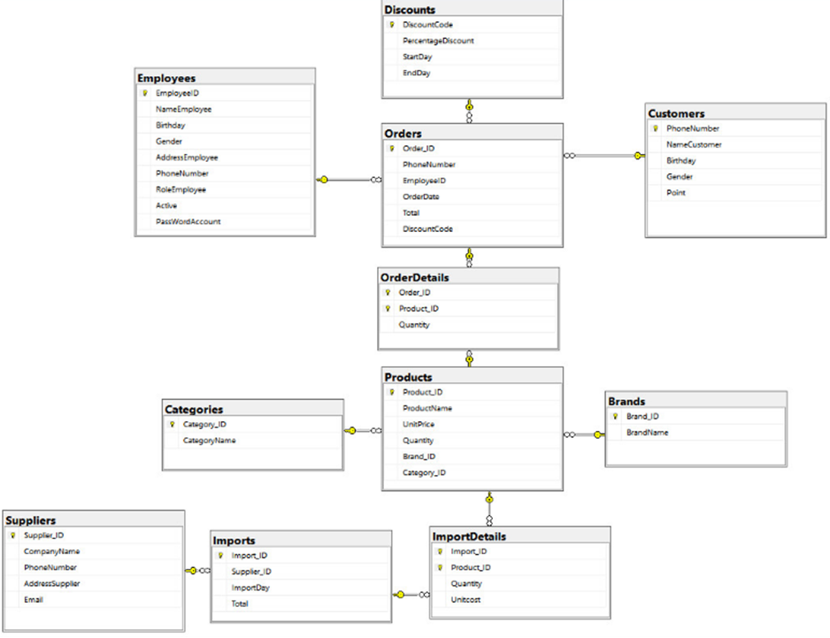
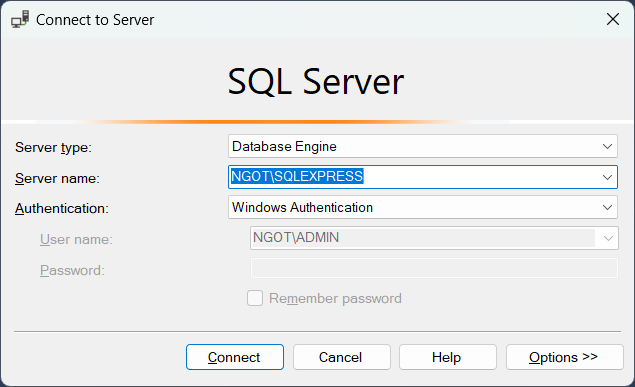
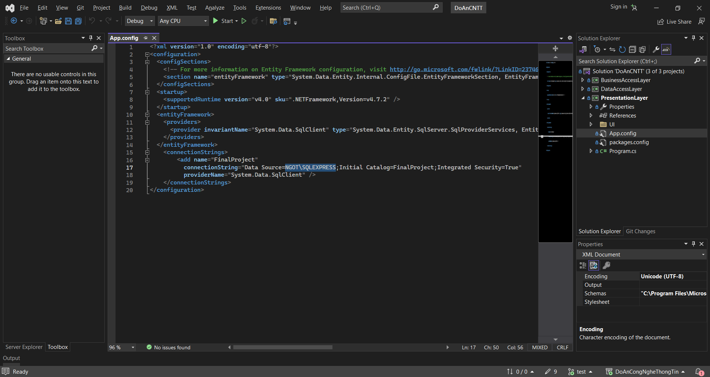
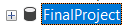
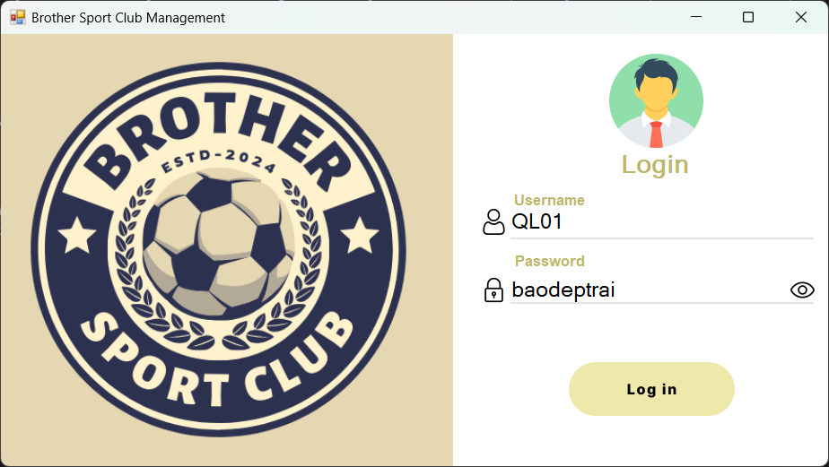
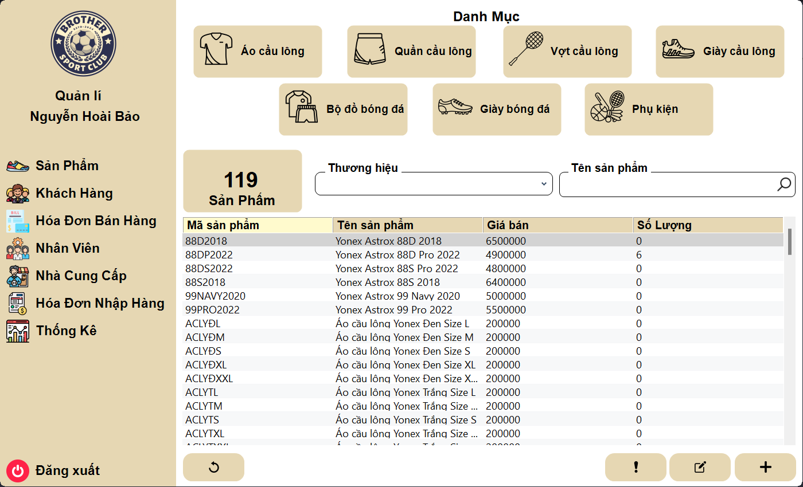

# Information Technology Project
## Overview
This repository contains the final project report and source code for the "Sports Store Management System" developed during the first semester of the 2024 - 2025 academic year.<br>
The system is designed to streamline the management of a sports store, covering various operations such as employee, customer, product, and invoice management.<br>
## Team Information
Student Name: Nguyễn Hoài Bảo<br>
Student ID: 22110108<br>
Contribution: 100%<br>
## Project Objectives
The main goal of this project is to implement a robust management system that simplifies the following processes:<br>
Employee and customer management.<br>
Inventory and product categorization.<br>
Invoice and supplier tracking.<br>
Comprehensive sales and revenue reporting.<br>
## System Architecture
### Entity-Relationship Diagram (ERD)
The system is based on a well-defined ERD that models entities such as customers, employees, products, orders, and suppliers, along with their relationships.<br>
## Features
### 1. Customer Management
Add, update, and search for customer information.<br>
Maintain customer purchase history and loyalty points.<br>
### 2. Product Management
Add, update, and categorize products by type and brand.<br>
Manage stock levels for various sizes and colors.<br>
### 3. Invoice Management
Generate, update, and delete invoices for sales and purchases.<br>
Apply and track discounts using a discount management system.<br>
### 4. Employee and Supplier Management
Manage employee roles and permissions.<br>
Track supplier information and purchase orders.<br>
### 5. Reporting and Analytics
Generate reports on sales, profits, and inventory.<br>
Analyze customer purchase trends.<br>
## System Architecture
### Entity-Relationship Diagram (ERD)
The system is based on a well-defined ERD that models entities such as customers, employees, products, orders, and suppliers, along with their relationships.<br>

## How to Use the Application
### Login
Employees log in using their unique credentials.<br>
Permissions are assigned based on roles (manager or sales staff).<br>
Username: QL01<br>
Password: baodeptrai<br>
### Navigation
Use the main menu to access features such as product management, customer management, and reporting.<br>
### Creating Transactions
Sales staff can create invoices, apply discounts, and finalize sales transactions.<br>
Managers can review and modify invoices as needed.<br>
### Generating Reports
Use the reporting interface to analyze data based on specific timeframes.<br>
## Installation and Setup
### 1. Clone the repository:
```bash
git clone https://github.com/ToiLaBao2004/DoAnCNTT.git
```
### 2. Set up the database:
Open SQL Server and copy Server name<br>

### 3. Configure the application:
Update the App.config file with your database connection details.<br>

### 4. Run Application
Run the application and log in, on the SQL Server there will be a database named FinalProject<br>



## Work management
https://shore-chiller-17d.notion.site/Final-Project-13add384831d80eb8042ee95a11278ea?pvs=4